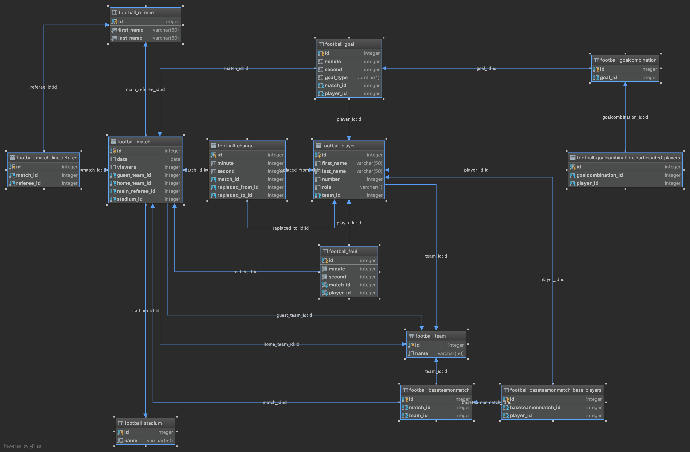

# Football App 
 
Šis aplikācijas mērķis ir apkopot informāciju kura iegūta no JSON failiem. 
 
Aplikācijas sastāvdaļas: 
* Futbola aplikācija - apstrādā JSON failus, veido tabulas datubāzē 
* Futbola statistikas aplikācija - apkopo informāciju no datubāzēm un veido pārskatāmas html tabulas 
 
Izmantotas tehnoloģijas: 
* Python 3.7 
* Django 2.1 
* PostgreSQL 10.3 
* Nginx 1.13 
* Redis 4 
* Docker 18.09 
* Docker Compose 1.23 
 
 
### Priekšnoteikumi 
 
1. Pieinstalēt Docker un Docker Compose https://hub.docker.com/search?q=docker&type=edition&offering=community 
 
 
### Kā palaist aplikāciju: 
 
1. Izveidot un palaist docker konteinerus  
    ```bash 
    docker-compose up -d 
    ``` 
 
2. Palaist datubāzes migrācijas 
    ```bash 
    docker-compose exec app python manage.py migrate 
    ``` 
 
3. Iekopēt statiskus failus 
    ```bash 
    docker-compose exec app python manage.py collectstatic --no-input 
    ``` 
 
4. Atvērt `http://localhost:8080` brauzerī 


### Datubāzes struktūra
 
 
### Cita dokumentācija 
1. [Statistikas tabulas](statistics.md) 
2. [Lietotāja dokumentācija](user-guides.md) 
2. [Tehniska dokumentācija](technical-documentation.md) 
