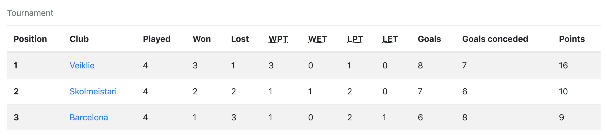
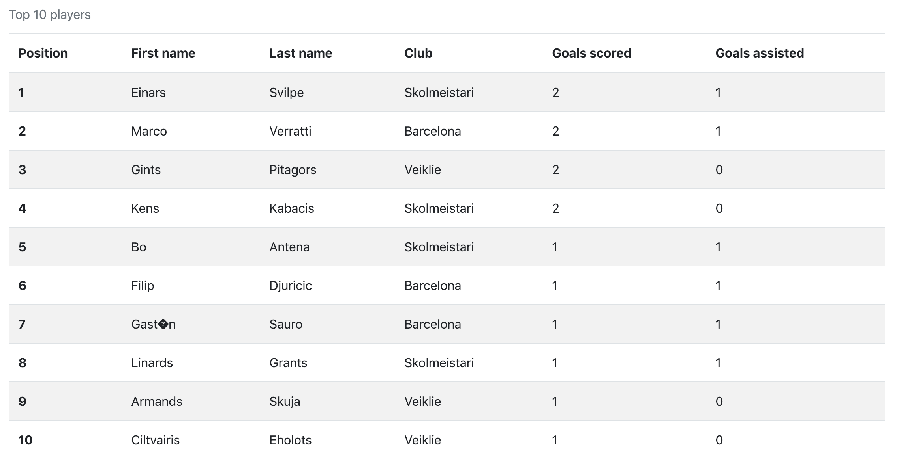
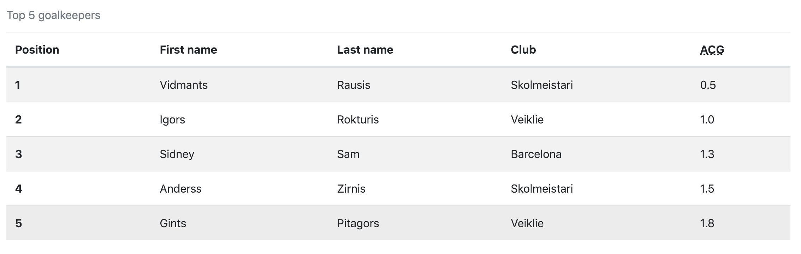
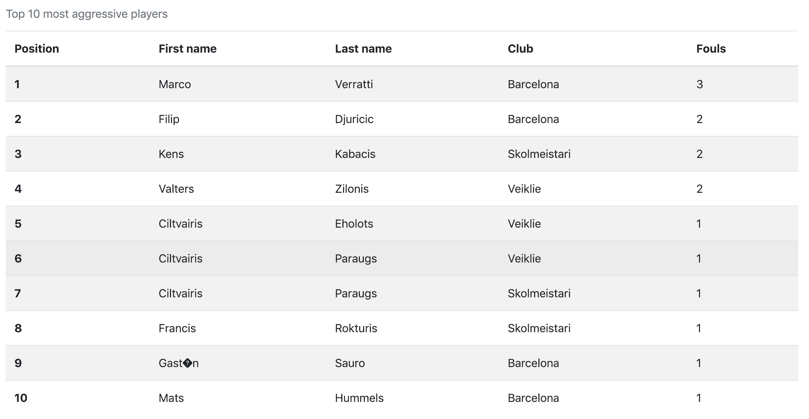
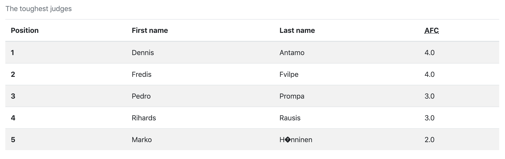
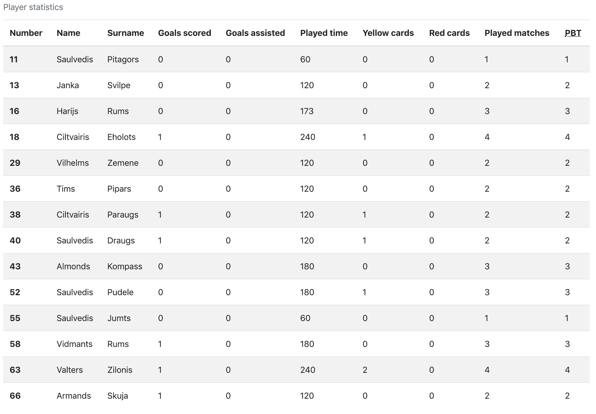
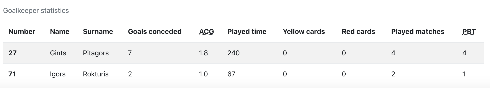
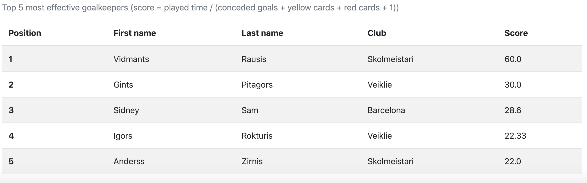

# Futbola statistika 
 
Aplikācijā ir pieejami sekojoši statistikas radītāji: 
 
1. Turnīra tabula; 
 
2. Turnīra desmit rezultatīvāki spēlētāji; 
 
3. Turnīra pieci labākie vārtsargi; 
 
4. Turnīra desmit rupjākie spēlētāji; 
 
5. Turnīra "stingrākie" tiesneši; 
 
6. Visu vienas komandas spēlētāju apkopojošā statistika. 
 
 
 
Papildus ir sekojošas tabulas: 
1. Turnīra desmit efektīvākie spēlētāji; 
 
3. Turnīra pieci efektīvākie vārtsargi. 
 
