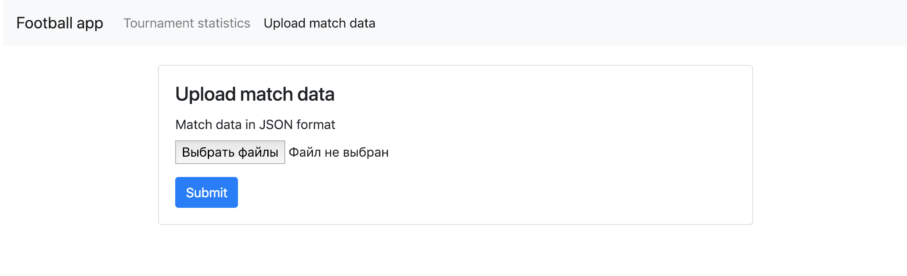

# User guides 
 
### Kā ielādēt datus par spēli 
 
#### Caur UI interfeisu 
 
1. Atvērt `http://localhost:8080/match/upload` 
 
2. Pievienot failus. (Var pievienot vairākus failus uzreiz) 
3. Nospiest "Submit" 
 
#### Caur terminālu 
 
1. Ielikt failus zem `app/tmp` 
2. Palaist komandu. (Ir iespējams pievienot tikai vienu failu uzreiz) 
    ```bash 
    docker-compose exec app python manage.py import_matches /usr/src/app/tmp/{file_name} 
    ``` 
 
### Kā apskatīt futbola statistiku 
 
1. Atvērt `http://localhost:8080/statistics/tournament/` 
2. Visi statistikas radītāji, izņemot statistiku par katru komandu, ir pieejami šajā lapā 
3. Lai apskatītu statistiku par atsevišķu komandu vajag nospiest uz komandas nosaukumu turnīra tabulā 
